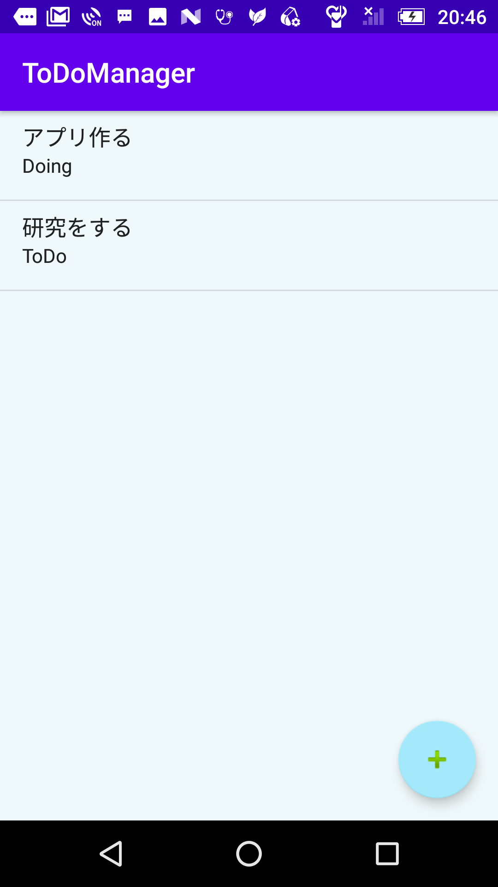
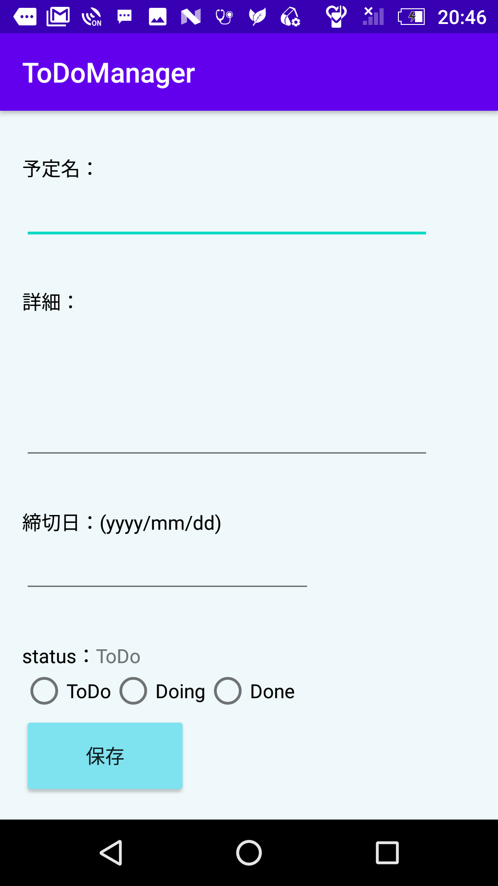
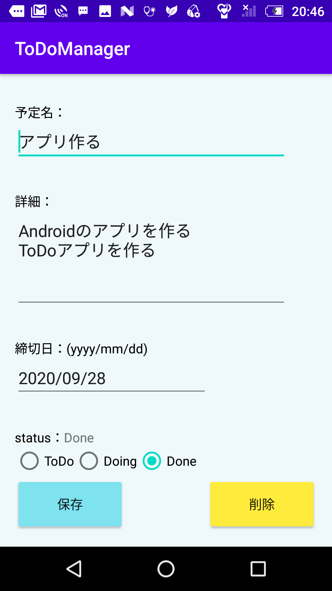

# ToDoManager
タスク管理できるAndroidアプリです．
"To Do"・"Doing"・"Done"の三段階でタスクを管理できます．

## 使い方
<!-- -->


- タスクを一覧表示している画面です．
- 右下の"+"ボタンを押すことでタスクを追加できます．
- タスクをタップすることでタスクの詳細な表示が行えます．
<!-- -->


- タスクの追加画面です．
- 各項目を記入して保存ボタンを押すと一覧にタスクが追加されます．．
<!-- -->


- タスクの修正画面です．
- タスクの名称や詳細，締め切り日，状態の変更のほか，タスクの削除もこの画面で行えます．
<!-- -->


- ラジオボタンを押すことによってタスクの状態を変更することができます．

## インストール方法
1. このリポジトリを```clone```し，AndroidStudio等で開きます．
1. インストールしたいAndroid端末の「設定」からビルド番号の項目を7回連続でタップし，開発者モードをオンにします．
1. 「開発者向けオプション」からUSBデバッグを有効にします．
1. PCと端末をUSBで接続し，AndroidStudio上部の実行ボタン（緑の横向き三角形）を押して，端末へアプリをインストールします．
